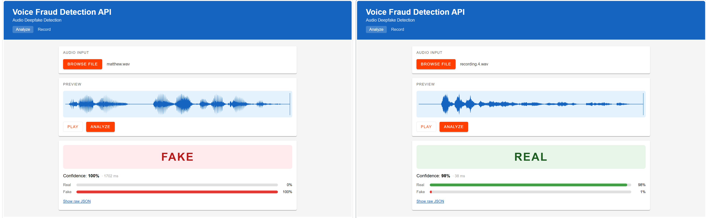

# Demo App



This folder contains a SvelteKit app that you may use to test the API.

## Pre-requisites

- Node.js
- npm

## How to run it?

Create `.env` and add following variables (replacing values as necessary):

```
PUBLIC_API_URL=http://localhost:8000
PUBLIC_API_TOKEN=test-token
```

then run:

```
npm ci
npm run dev
```

open browser and goto `http://localhost:5173/` or the URL given by `npm run dev`

## How to generate synthetic voices?

You can use AWS Polly to generate synthetic voices (deepfakes) for testing. Google and Microsoft provide similar APIs.